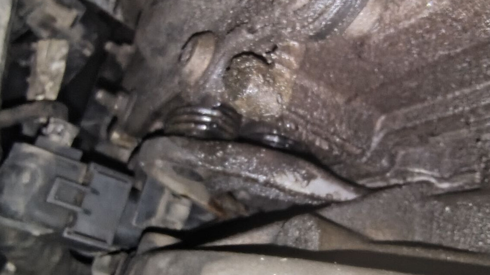
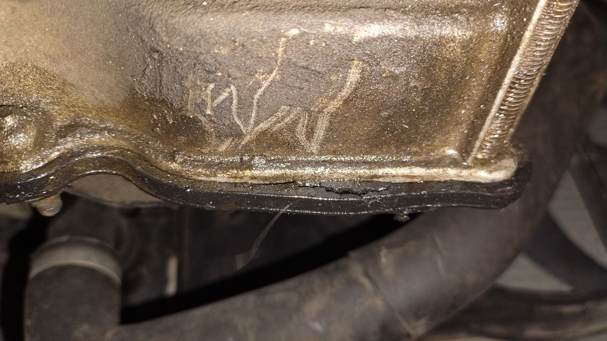
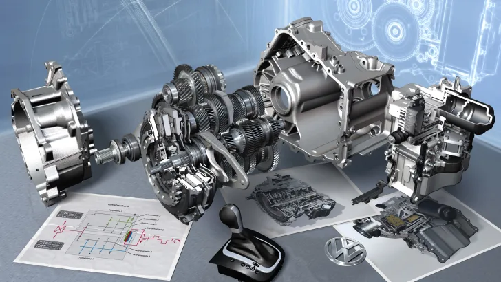
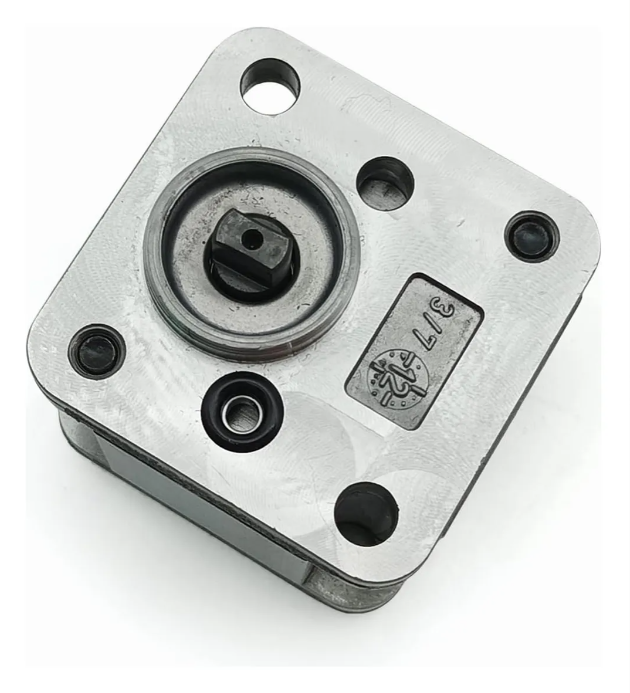
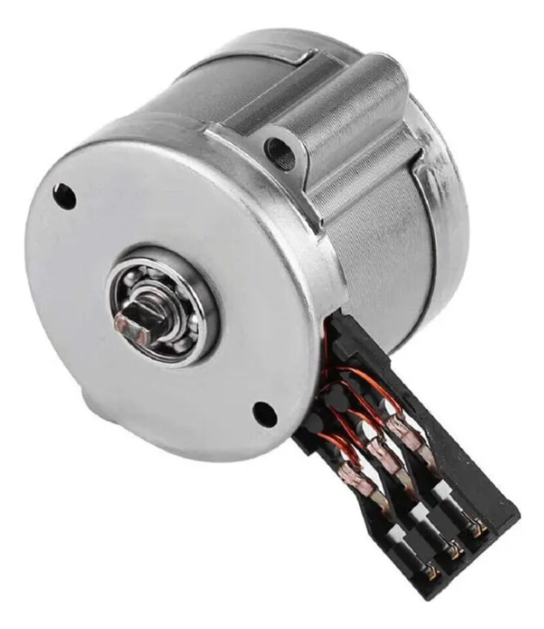
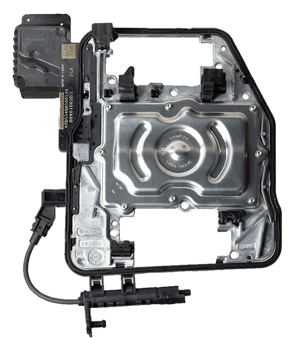
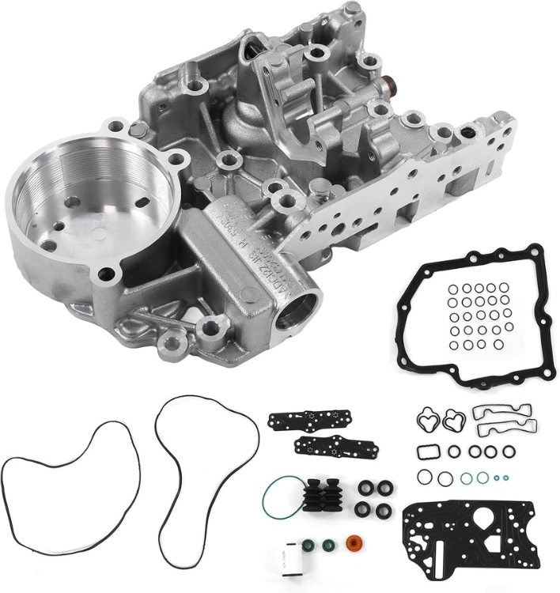
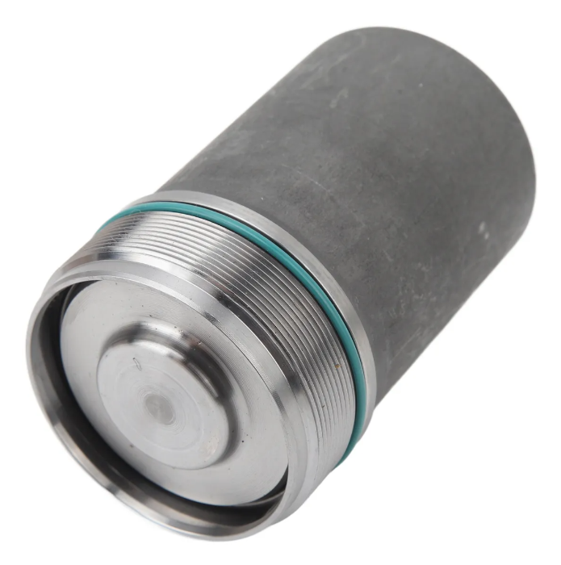

## Audi 2015 Motor 1.4 LT

### Problemas encontrados

- Fuga En Mecatronica en cubrepolvos de acordion}

- Empaque de carter Roto

- Codigos de falla de Transmision
- Codigos de falla de Motor

### Codigos de Falla Motor

- **U1123** Bus de datos, Valor erróneo recibido
- **U0428** Sensor de ángulo de giro del volante Señal no plausible
- **P0017** Bancada 1, sensor de posición árbol de levas/ cigueñal 2 - Asignación incorrecta
- **P0300** Detectado un fallo de combustion
- **P0301** Cil 1 - detectado un fallo de combustión
- **P164a** Conmutador presion aceite -señal no plausible
- **P2227** Sensor 1 de la presiondel aire -señal noplausible
- **P0302** cil 2 - Detectadoun fallo de combustión
- **P130A** Supresión de cilindros

### Codigos de Falla de Transmisión

- **P2797** Bomba hidraulica adicional para el aceite del cambio - Señal no plausible
- **P0B0C** Bomba hidráulica adicional para el aceite del cambio - fuga Hidraulica
- **U0415** UC para ABS, freno - Señal no plausible (Posible Causa al deconectar bateria)
- **P17BF** Bomba hidráulica - Proteccion contra Juego

### Codigos de Falla ABS

- **B116816** sensor de ángulo de giro del volante - Tension isuficiente (Posible causa por desconectar bateria)
- **U1123**   Bus de datos, valor erroneo recibido

### Codigos de Falla Transmision

### Descripcion y Causa Codigo de falla P2797

El Código de falla **P2797** indica un problema de rendimiento de la bomba auxiliar de fluido de transmisión. Esta bomba es responsable de generar la presión hidraulica en la transmisión. El codigo de falla sugiere que la bomba estas fallando.

El código **P2797** significa que la bomba auxiliar de fluido de transmisión no esta funcionando correctamente. El código puede ser desencadenado por varias razones incluyendo:

#### Falla de la bomba Hidraulica  o Motor Electrico

La bomba Hidraulica puede estar dañada o defectuosa y no esta generando la presion necesaria o El motor Electrico de la bomba.

#### Bomba Hidraulica

#### Motor Electrico Bomba

#### Problemas con el modulo o Cableado modulo

Un cableado dañado o desconectado puede afectar el rendimiento de la bomba.

En algunos casos, un problema con el módulo de control de la transmisión puede afectar la bomba auxiliar. 
Soluciones:

Si el código **P2797** es el único código establecido, la solución más probable es reemplazar la bomba auxiliar de fluido de transmisión. 
Si hay otros códigos establecidos, es importante seguir los procedimientos de diagnóstico apropiados para identificar y solucionar el problema principal. 
En algunos casos, puede ser necesario revisar el cableado, el módulo de control del inversor de potencia o el módulo de control de la transmisión. 

### Descripcion y Causa Codigo de falla P0B0C

El código de falla **P0B0C** indica un problema con la bomba de fluido de la mecatronica eléctrica/Hidraulico 'A', especificamente una fuga hidráulica. Esto significa que la bomba no está funcionando correctamente y podría haber una fuga en el sistema hidráulico de la mecatronica.

 
#### El código P0B0C puede indicar:

##### Fuga hidráulica en la bomba:
La bomba de fluido de la mecatronica no está funcionando correctamente y puede haber una fuga en el sistema hidráulico. 

##### Problemas en la mecatronica
La fuga hidráulica puede afectar el funcionamiento de la transmisión, causando que el vehículo se quede inmovilizado.

##### Luz de check engine encendida:
El código de falla **P0B0C** generalmente encenderá la luz de "Check Engine" en el tablero. 

#### Para solucionar este problema:

1. Identificar la fuga:
Es importante identificar la fuente de la fuga hidráulica en la bomba de fluido de mecatronica.
2. Reparar o reemplazar la bomba:
Una vez identificada la fuga, se debe reparar o reemplazar la bomba de fluido de mecatronica.
3. Revisar el sistema de transmisión:
Se debe revisar el sistema de mecatronica para asegurarnos de que no haya otros problemas causados por la fuga.
4. Limpiar el código de falla:
Después de reparar el problema, se debe limpiar el código de falla P0B0C con una herramienta de diagnóstico OBD2. 

### Descripcion y Causa Codigo de falla P17BF

El código de error **P17BF**, indica que la unidad de control de la transmisión (ECU) ha detectado que la bomba hidráulica de la transmisión DSG ha alcanzado su límite máximo de protección. Esto generalmente se debe a problemas de presión hidráulica dentro de la mecatrónica de la transmisión DSG. 

### Más detalles:
#### Causa:
La bomba hidráulica está sobrecargada o no está generando la presión necesaria para realizar los cambios de marcha. Esto puede ocurrir debido a varios factores, como: 
Problemas de presión en la mecatrónica. 
##### El acumulador de presión no está generando la presión adecuada. 

Desgaste o daño de los componentes de la mecatrónica. 
##### Fugas en el sistema hidráulico. 
Síntomas:
Cambios de marcha erráticos o tardíos. 
Arrancar en segunda marcha de repente. 
Problemas de vibración al acelerar. 
Solución:
La solución más común es la reconstrucción o reemplazo del cuerpo hidráulico de la mecatrónica, que es donde se encuentra la bomba y otros componentes hidráulicos. 
En algunos casos, puede ser necesario realizar una limpieza o reparación de otros componentes, como los embragues, según un artículo de Service4Service. 