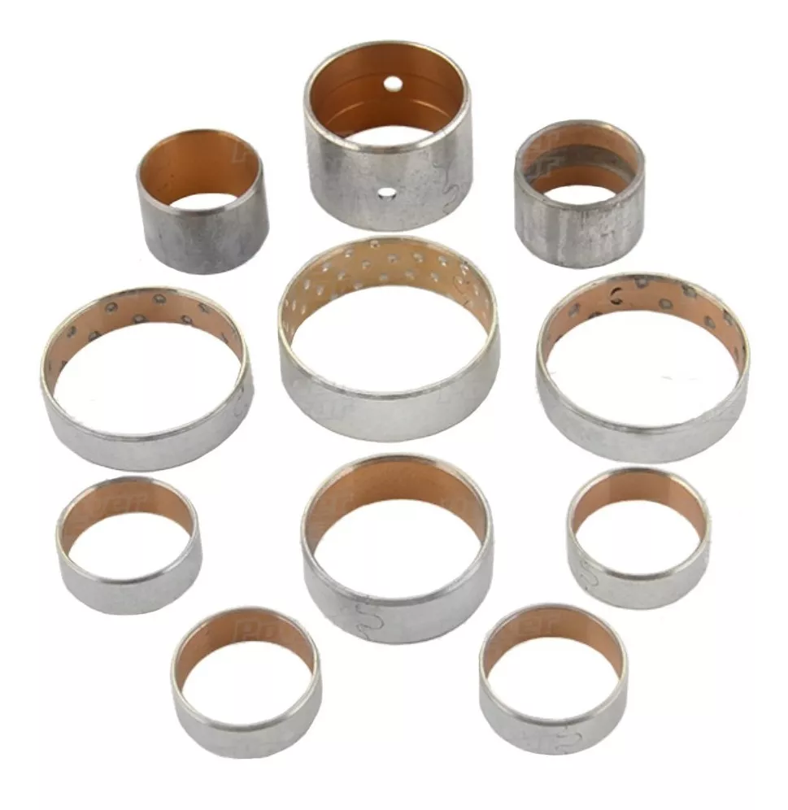

## Transmision suelta partes a cambiar

1. Bomba de Aceite bujes dañados
2. Tambor de Flecha picada y bujes girados
3. Turbina Recalentada
4. Discos de Friccion y Acero
5. juego de Bujes
6. Banda
7. Filtro
8. Juego solenoides modulados
9. Instalar enfriador adicional para evitar recalentamiento
10. Cuerpo de valvulas aun pendiente de chequeo se checa hasta ya autorizado el trabajo
11. Kit de ligas retenes y empaques

## 1. Bomba Bujes dañados.

## 2. Tambor flecha avance Picada y bujes girados.

## 3. Turbina Recalentada.

## 4. Discos de Friccion y de aceros recalentados.

## 5. Juego de Bujes.

## 6. Banda.

## 7. Filtro.

