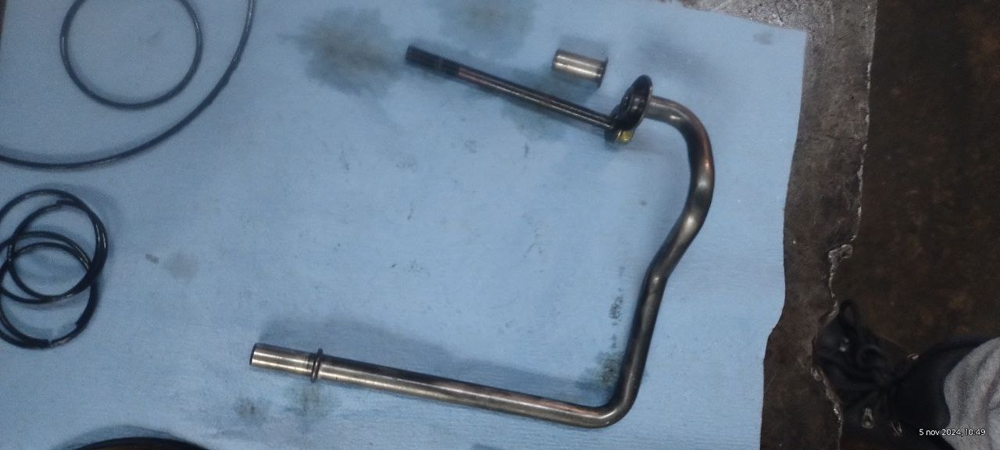

# Honda Accord 2005

Transmision avanzaba bien unas cuadras y despues empezaba a fallar con sintomas de patinaje en 3ra velocidad 
Luego dejaba de haber 3ra y se brincaba a 4ta velocidad y se neutraliza ya despues de un rato y presento los 
siguientes codigos de falla

1. **71-03**: Valvula de solenoide B Cambio Atascada en posicion OFF
2. **09-03**: No hay señal en el sensor de velocidad del eje de salida

## Problemas Encontrados

Se Reparo Transmision se encontraron Ligas y Pistones duros Tambien el tubo de cuerpo de valvulas se encontro rota y filtro tapado aceite muy sucio o tapado

s