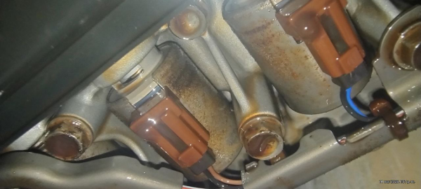

# Mazda 2017 CX-3

Mazda Presenta Patinamiento en 1ra Velocidad 3ra Velocidad y 4ta Velocidad

### Codigos de Falla

1. **P0731**: Relacion engranaje incorrecta en 1ra 
2. **P0751**: Fallo de funcionamiento del solenoide de cambio 1ra o atascado en la posicion de desconexion
3. **P0780**: Malfuncionamiento del cambio de Engranajes 

### Sintomas Presentes en la Transmision Antes del Cambio de Aceite

- Al poner Drive tarda en aplicar
- Se Patina al Querer aplicar 3ra velocidad
- Se patina en 4ta velocidad

### Condiciones del Aceite

### Condicion de los solenoides

### Sintomas despues del cambio de Aceite

- Este ya entra en modo protegido mas rapido evitando un daño mayor a la transmisión.
- Transmision genera código de falla al momento de la aplicacion en 1ra velocidad
- Transmsion inicia en 2da Velocidad
- Genera Codigos de falla y se protege en 5ta Velocidad

### Causas

Al reemplazar el aceite viejo por el nuevo, el aceite interno redujo su viscosidad. Y debido al daño y desgaste que ya presenta la transmisión, 
la TCM  o modulo de transmisión logró detectar más rápido el problema que ya presenta la transmisión automática, y entro en pr otocolo
de proteccion a la transmision el cual en esta transmision reacciona aplicando en 2da velocidad para evitar deslizamiento y evitar mas daño.

### Codigos de Falla Despues del Cambio de ACeite

1. **P0732**: Relacion incorrecta en 2da
2. **P0780**: Malfuncionamiento en el cambio de Velocidad o Engranaje
3. **P1728**: Deslizamiento en Embrague

En mazda existe un boletin técnico donde menciona que cuando presenta códigos de solenoides por ejemplo **P0751**: _Fallo de funcionamiento del solenoide de cambio 1ra o atascado,_ acompañado de codigo **P0780**: _Malfuncionamiento en el cambio de Velocidad o Engranaje,_ esto quiere decir que el problema no esta en los solenoides y requiere una reparacion mayor en la transmisión automática.
Estos codigos son mas reales a los sintomas que presenta la unidad y se requiere una reparacion de transmision Automática.

### Partes a Considerar para la Reparacion

En estas unidades existen partes comunes que se suelen dañar o dicho de otra manera tienen puntos debiles de falla, estos puntos fragiles los subiere en otra plataforma de contenido que estoy preparando proximamente pero los mencionare en la parte de abajo.

En este caso, debido al daño que ya presenta, vamos a requerir las siguientes partes. Aunque cabe mencionar que la lista podría incrementarse una vez que se desarme la transmisión. Hay partes que no están incluidas, como el cuerpo de válvulas, solenoides, sprags de un solo giro, balero interno central y bomba de aceite, por mencionar algunas otras que suelen dañarse en esta transmisión. Sin embargo, no podemos determinar si serán necesarias cambiarlas hasta que se desmonte y revise, pieza por pieza, la transmisión.

Lo basico que requerimos de momento seria lo siguiente.

| Descripción                   |  Cantidad  |
|-------------------------------|------------|
| Juego de Empaque Con Pistones |     1      |
| Juego discos de Friccion      |     1      |
| Juego discos de acero o placas|     1      |
| Embrague o tambor Alta/Baja   |     1      |
| Turbina Reconstruida a cambio |     1      |
| Aceite Original Mazda         |     9      |
| Filtro                        |     1      |
| Silicon                       |     1      |
| Solvente para Lavar Partes    |     20 LT  |

👍 Esperando le sea util la informacion en este nuevo concepto, si existe alguna duda respecto al trabajo o retro alimentacion para ir mejorando el sitio favor de enviar email a _richard.transmix@gmail.com_ o enviar mensaje o llamada al telefono proporcionado gracias.