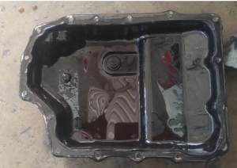

# Mazda 2017 CX-3

Mazda Presenta Patinamiento en 1ra Velocidad 3ra Velocidad y 4ta Velocidad

## Codigos de Falla

1. **P0731**: Relacion engranaje incorrecta en 1ra 
2. **P0751**: Fallo de funcionamiento del solenoide de cambio 1ra o atascado en la posicion de desconexion
3. **P0780**: Malfuncionamiento del cambio de Engranajes 

## Sintomas Presentes en la Transmision

- Al poner Drive tarda en aplicar
- Se Patina al Querer aplicar 3ra velocidad
- Se patina en 4ta velocidad

## Condiciones del Aceite

