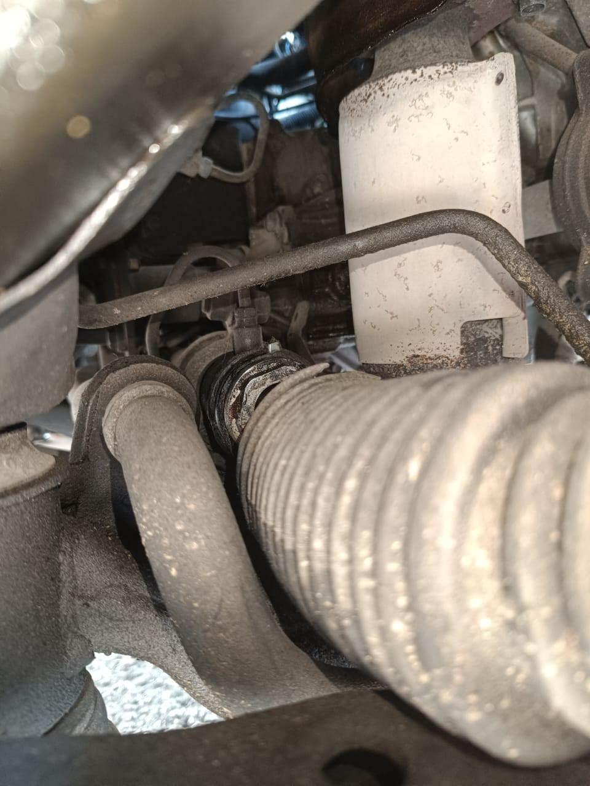
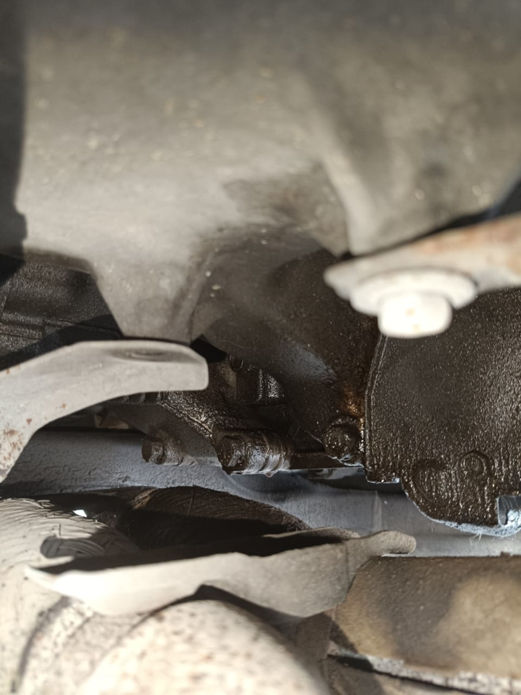

# Nissan Murano 2007 Motor 3.5 

### Sintomas

Transmision No Aplica en 1ra Velocidad se patina hay que aplicarlo en 1ra manual para que entre primera.

#### Otros Problemas encontrados en la revision rapida 

- Tiene Codigos de falla hay que escanear para saber que otras fallas tiene motor 
- Cubrepolvos de direccion Rotos
- Cubrepolvos de Flechas Homocineticas Rotas
- Fuga de aceite Motor Falta revisar con mas detalle para encontrar fuente
- Clima No Sirve
- Soporte Roto 

### Solucion
Transmision requiere una reparacion mayor hay que bajar caja, embrague discos y pistones internos de la transmision en mal estado.

### Cubre polvo Roto Dirección

### Fuga Motor Aceite 

#### Partes A considerar para la reparacion de la Transmisión Automatica.

Estas son algunas partes basicas que se requieren para una correcta reparacion de esta trasmisión, cabe mencionar que no son todas las partes que pudieramos llegar a necesitar
ya que en estas transmisiones tienen algunos puntos debiles que sufren desgaste con el tiempo y hay que revisarlos entre ellos las siguientes partes:

- Juego Planetarios
- Diferencial
- Copa Balero Homocinetico
- Solenoides 
- Cuerpo De Valvulas

Las Partes mencionadas arriba no se puede saber si estan en buenas condiciones hasta bajar y revisar la transmision pieza por pieza para determinar si se requieren mas partes en esta reparacion en particular.

#### Partes Basicas requeridas

| Descripción                   |  Cantidad  |
|-------------------------------|------------|
| Juego de Empaque Con Pistones |     1      |
| Juego discos de Friccion      |     1      |
| Juego discos de acero o placas|     1      |
| Banda Transmision             |     1      |
| Turbina Reconstruida a cambio |     1      |
| Aceite Merrcon V              |     12     |
| Filtro                        |     1      |
| Silicon                       |     1      |
| Solvente para Lavar Partes    |     20 LT  |

Gracias Por su visita cualquier duda pueden enviarme mensaje via whatsapp al telefono proporcionado gracias.

Fecha 25-03-2025

