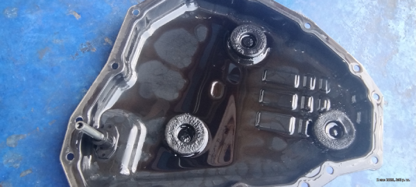
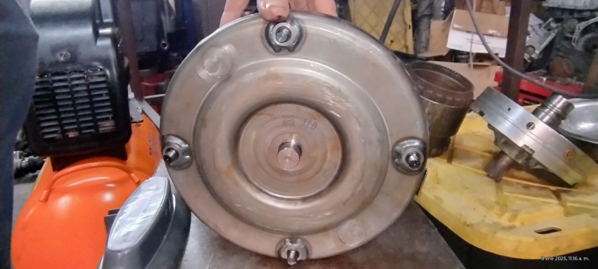
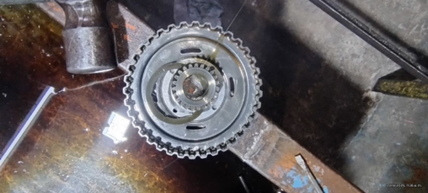
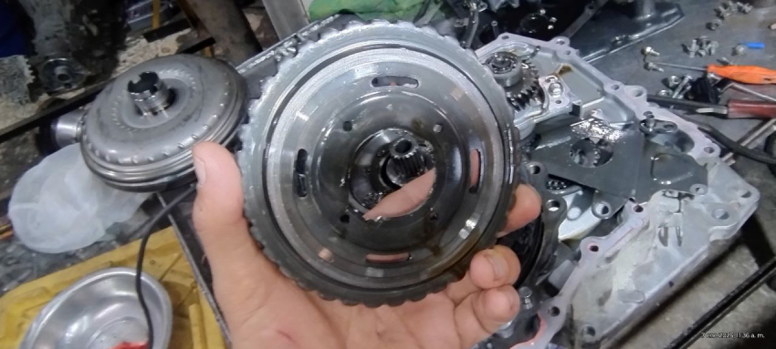

# Nissan Kicks 2015

La Transmisión No Aplica en Drive y se escucha un zumbido de bomba y un ruido de que algo está suelto o roto y solo cuenta con Reversa.

### Revisiones y otras detalles Encontrados
 
- Horquillas Rotas
- Soporte Transmisión roto
- Balatas desgastadas

#### Al Bajar Carter Se Encontro lo siguiente:

- Aceite Recalentado y Negro
- Rebaba en los imanes

#### Al desarmar Transmisión se Encontraron los siguientes Problemas

- Cadena Con Desgaste Inicial.
- Variador pista cadena con Inicios de Daño con estrías.
- Variadores pistones Con fugas de Aceite.
- Campana solar Rota.
- Ligas, Pistones y Retenes Duros por falta cambio de aceite.

#### Tipo Turbina 

- Turbina 07F

#### Problemas encontrados

- Engrane Solar tipo campana Rota

Lado de atras

- Ligas y pistones Duros
