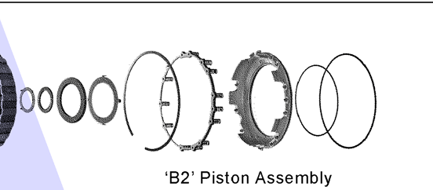
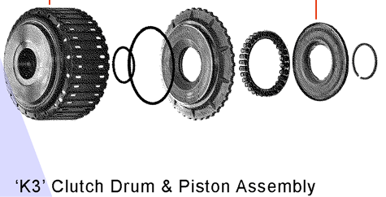

---
title: "Caso Volkswagen Passat 2014 Motor 2.5 Transmision 6 velocidades"
description: "La Transmision Automatica patina 3ra Velocidad y al poner Reversa tambien se detiene o se para motor."
category: "Reparacion Transmision"
image: "/passat.png"
pubDate: 2024-01-10
--- 

# Volkswagen Passat 2014 Motor 2.5 Transmision 6 Velocidades

La Transmisión Automática patina y golpea en 3ra velocidad y al poner reversa tambien se detiene o se para el motor.

#### Problemas Encontrados

- Piston del Freno B2 se salio el seguro y se rompio la Liga del Freno B2
    
- Discos de Friccion desgastados de K3 Freno B2 y aceros recalentados
- Tambor K3 pista donde trabaja teflon remarcado 
    
- Aceite al parecer parece mezclado con aceite de motor se cambio turbina
