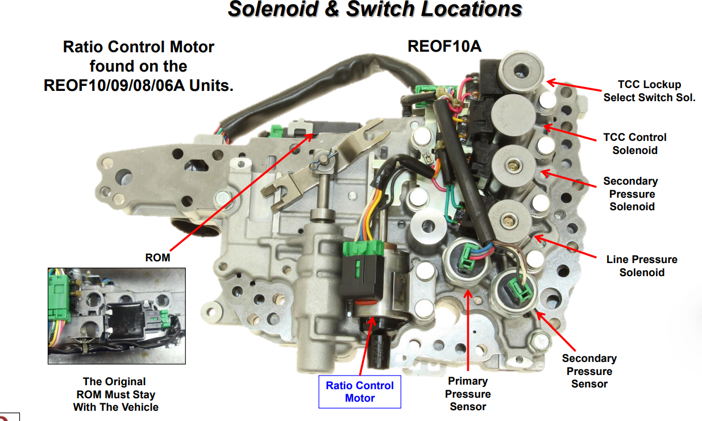
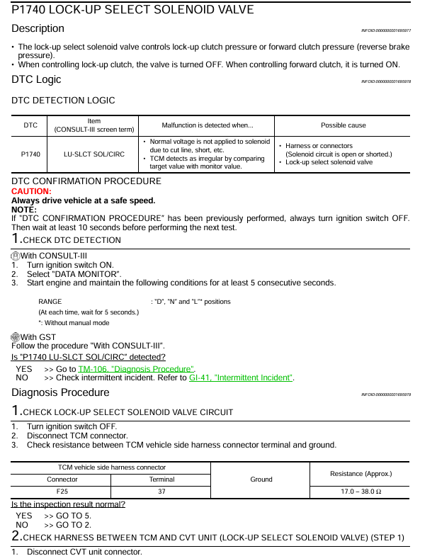
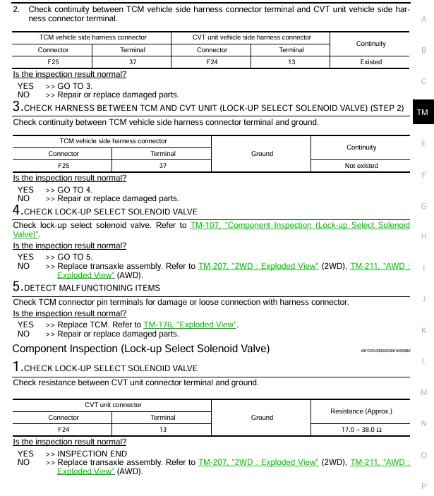
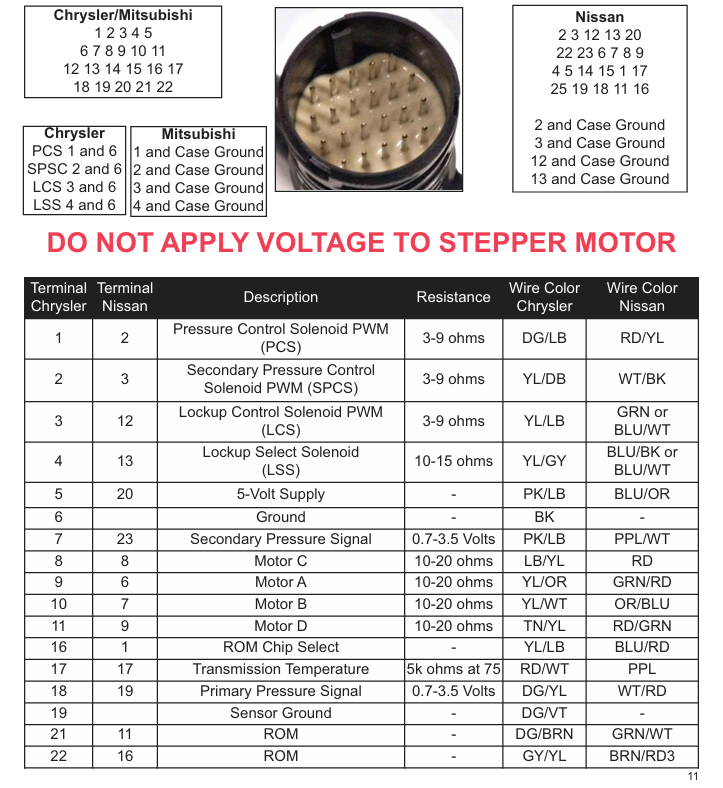

# Codigos de falla Rogue 

### Codigos de falla Motor

- **P0304** cilindro 4 Misfire
- **P0720** Sensor velocidad salida
- **P1740** Solenoide SLCT o Solenoide TCC 
- **P1715** Velocidad de polea de entrada
- **P1574** Sensor Velocidad ASCD

### Codigos de Falla Transmisión CVT

- **P0725** Velocidad motor (Historico) 
- **P0720** Sensor Velocidad Salida (Historico)
- **P1740** Solenoide SLCT o TCC (Presente)
- **P0746** Solenoide PC A (Historico)
- **P0868** Presión de fluido bajo (Historico)

## Problemas Encontrados

El Codigo de falla presente P1740 es Referente al solenoide TCC o solenoide de aplicacion de embrague de turbina de la transmision CVT.

Imagenes Para El procedimiento de diagnostico y chequeo

### Cuerpo Valvulas

### Tabla de diagnostico

Hoja 2

### Diagrama Conector

