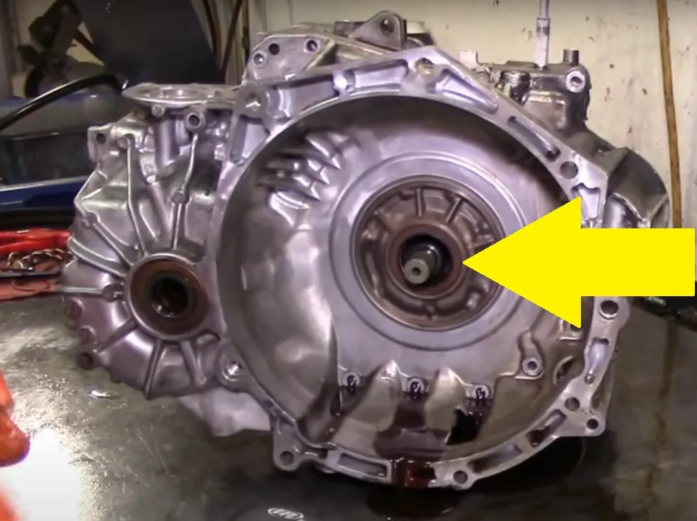
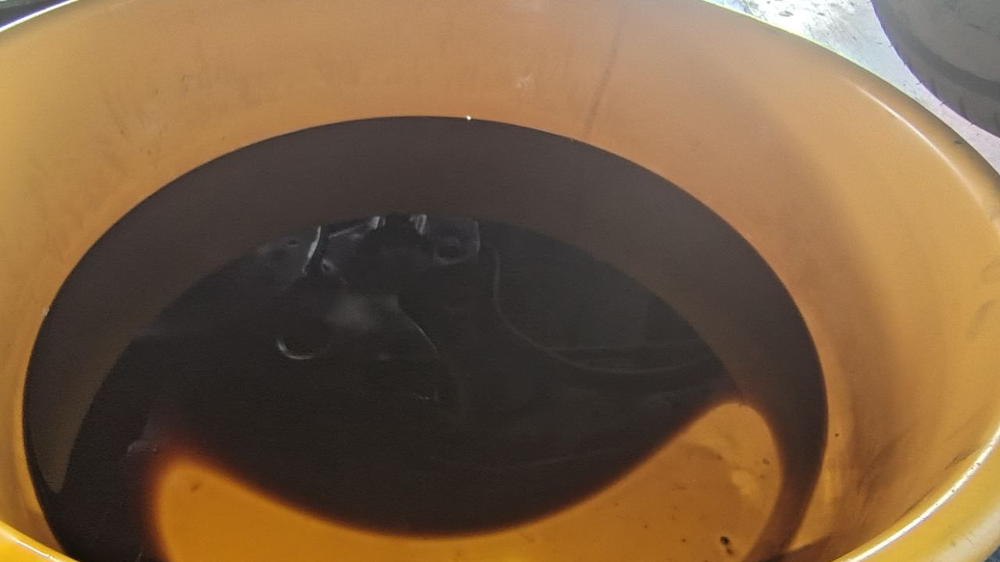
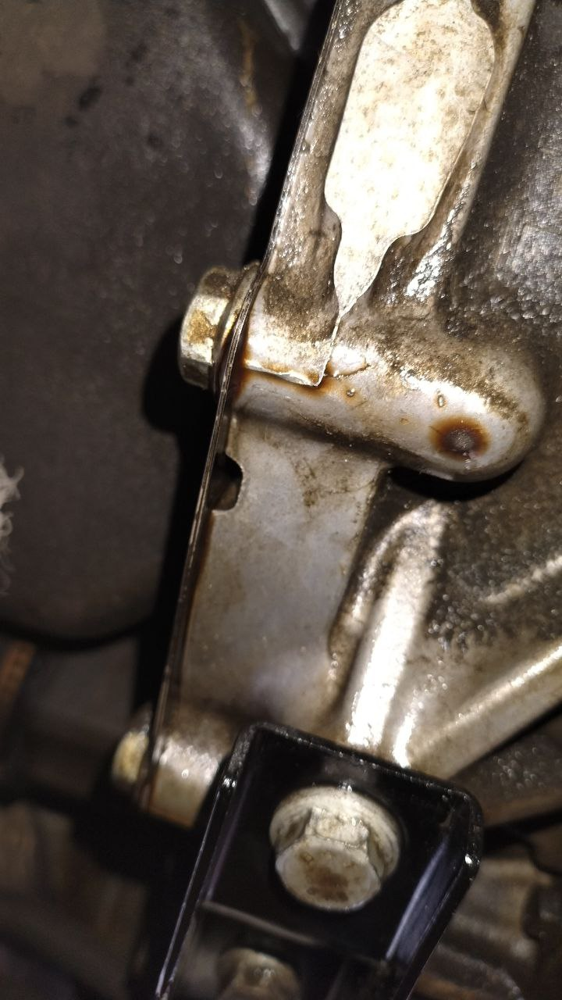
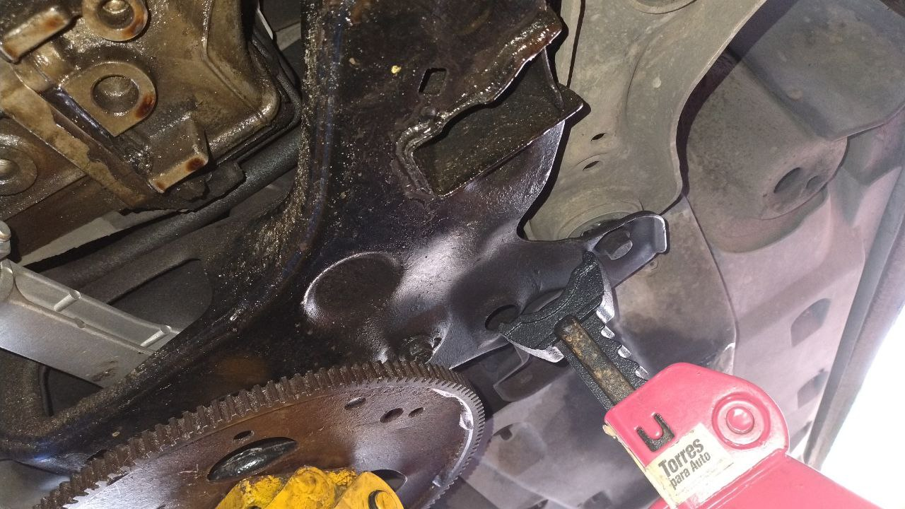
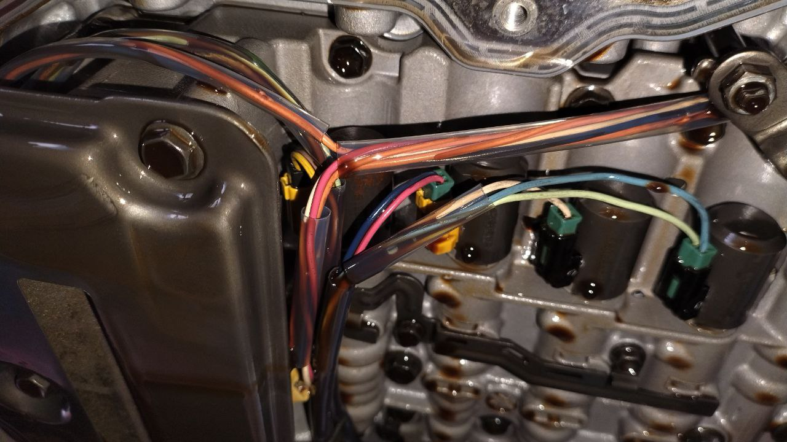
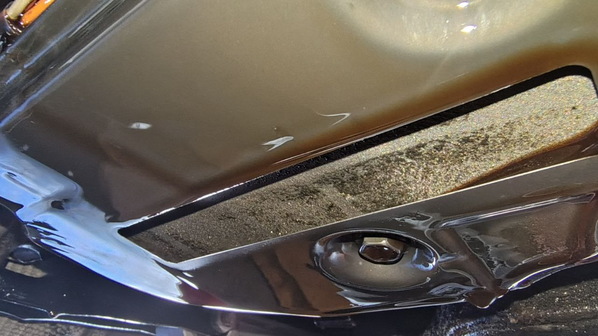

# VolksWagen 2015 Vento Motor 1.6LT 09G

### Sintomas

Transmision Automatica se Neutraliza en frio una vez Calienta empieza Avanzar, una vez que avanza se patinan el cambio y realiza  los cambios por los patinados antes de tiempo y en ocaciones golpean los cambios al entrar la velocidad.

#### Problemas Encontrados

- Bajo nivel de aceite.
- Transmision automatica con fuga de aceite en reten de turbina.

#### Posibles Soluciones a sintomas

- Cambiar Aceite a Transmision (Realizado)
- Sellar fuga de reten de turbina a Transmision para evitar dallos a futuro por bajo nivel de aceite (Pendiente)

### Revisiones Realizadas

- Nivel de Aceite
- Fugas de Transmision

#### Nivel de Aceite Encontrado

#### Fuga Aceite

Fuga de aceite que se ve debajo del vehiculo localizado en el reten de turbina este gotea al estar parado y al andar ya que se extiende la mancha hasta atras del vehiculo llegando a mojar el puente donde se asienta soporte de trasero

Fuga de la turbina seve como el aceite sale entre la union de la transmision y el motor del vehiculo.

Vista donde se ve hasta donde se extiende la mancha de aceite por la fuga en reten de turbina Solucion bajar transmision para cambiar reten

#### Condiciones Filtro y Solenoides

Lo gris que se ve pegado en las superficies de metal es desgaste de metal que se adiere.

En esta imagen se ve pasta de el clutch de turbina en el filtro

### Materiales Utilizados

- Filtro.
- Empaque .
- Aceite Mercon V.

 
